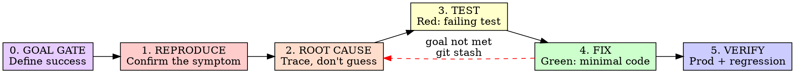

# Full-Stack Bug Fixing

Reproduce. Root-cause. Test. Fix. Verify. In that order.

**Core principle:** Never fix what you haven't traced. Never ship what you haven't tested. A symptom fix that doesn't address the root cause will come back.

**Violating the letter of this process is violating the spirit of debugging.**

## When to Use

- User reports something broken, missing, or wrong
- Data that was there is now gone or zeroed
- A bug you fixed before has come back
- Silent failures (no error, but wrong result)
- Behavior differs between frontend display and stored data

## Phase 0: Goal Gate (before anything else)

Before touching code, write down:

1. **What does "fixed" look like?** — Observable, testable behavior. Not "it works" but "the typing indicator disappears within 2s of tapping Connect, a result message appears, and the next step loads."
2. **How will you verify it?** — The exact steps or commands that confirm the goal is met.

Write these in your first message. If you can't state the goal precisely, you don't understand the bug well enough to fix it.

**Why (Karpathy):** LLMs excel at iterating toward specific, measurable goals. Vague goals produce vague fixes. The health connect bug took 3 attempts because "make it work" was never decomposed into testable criteria.

## The Ratchet Rule

Each fix attempt is a commit. After each attempt:

- **Goal met?** → Keep the commit. Proceed to verify.
- **Goal NOT met?** → `git stash` or `git reset`. Return to Phase 2 with new evidence. Do NOT stack another fix on top.
- **3 attempts failed?** → Stop. Question the architecture. The pattern is wrong, not just the implementation.

Code can only move forward. Failed attempts get reverted, not amended.

## The Six Phases



Complete each phase before moving to the next. No skipping.

---

### Phase 1: Reproduce

Before any investigation, confirm the symptom is real and understand its scope.

**For data bugs (missing/wrong values):**
```
1. Query the actual stored data (DB, not API response)
2. Compare stored data vs what the UI shows
3. Check if the issue is one user or systemic (query multiple users)
4. Note the timestamps — when was the data last written?
```

**For behavior bugs:**
```
1. Follow the exact steps the user described
2. Check both frontend console and backend logs
3. Note: does it happen every time or intermittently?
```

**State one sentence:** "The symptom is X, affecting Y users, since Z."

If you can't reproduce it, gather more data. Don't guess.

---

### Phase 2: Root Cause

**REQUIRED:** Read `superpowers:systematic-debugging` for the full root cause methodology. This phase adds full-stack-specific patterns.

#### Trace Across the Stack

For every bug, identify which layer is wrong:

```
Frontend (React) → API request → Backend (FastAPI) → Service → DB
                 ← API response ←                  ← Query  ←
```

At each boundary, verify:
- What data goes in?
- What data comes out?
- Does the shape match what the other side expects?

#### The Pydantic Trap (Python/FastAPI)

Pydantic models fill defaults for unset fields. This silently corrupts data on partial updates.

**Pattern to watch for:**
```python
# DANGEROUS: wholesale replacement
if body.nested_model is not None:
    profile.nested_model = body.nested_model  # zeros unset fields!

# SAFE: merge only what was sent
if body.nested_model is not None:
    profile.nested_model = profile.nested_model.model_copy(
        update=body.nested_model.model_dump(exclude_unset=True)
    )
```

**Check:** Does any PUT/PATCH endpoint replace a nested object wholesale? If a client sends `{nested: {one_field: value}}`, do sibling fields survive?

#### The Validation Failure Cascade

When `Model(**stored_data)` throws, watch for recovery paths that silently drop fields:

```python
try:
    obj = Model(**data)
except Exception:
    obj = Model(id=data["id"])  # everything else lost!
    for key in CRITICAL_FIELDS:  # only these survive
        setattr(obj, key, data.get(key))
```

**Check:** What happens when stored data doesn't match the current model schema? Does the recovery path preserve enough?

#### The Stale Closure Trap (React)

Effects and callbacks capture variables from the render they were created in. Async code that resolves later uses stale values.

```typescript
// DANGEROUS: stale state in async callback
useEffect(() => {
  fetchData().then(data => {
    setItems([...items, ...data])  // items is stale if component re-rendered
  })
}, [])

// SAFE: functional update or ref
useEffect(() => {
  fetchData().then(data => {
    setItems(prev => [...prev, ...data])  // always reads latest
  })
}, [])
```

**Check:** Does any async callback (fetch, setTimeout, event listener) read state directly instead of using a functional update or ref?

#### The Race Condition Trap (React)

When a component re-renders while an async operation is in flight, the old response can arrive after the new one, overwriting correct data with stale data.

```typescript
// DANGEROUS: no cancellation, responses can arrive out of order
useEffect(() => {
  fetch(`/api/search?q=${query}`).then(r => r.json()).then(setResults)
}, [query])

// SAFE: AbortController cancels stale requests
useEffect(() => {
  const controller = new AbortController()
  fetch(`/api/search?q=${query}`, { signal: controller.signal })
    .then(r => r.json()).then(setResults)
    .catch(e => { if (e.name !== 'AbortError') throw e })
  return () => controller.abort()
}, [query])
```

**Check:** Does any useEffect that fetches data based on a dependency have cleanup that cancels the previous request?

#### The Falsy Value Trap (JavaScript)

`0`, `""`, `null`, `undefined`, and `false` are all falsy. Guard clauses that use truthiness checks silently skip valid data.

```typescript
// DANGEROUS: skips records where session_id is "" (empty string)
if (record.session_id && record.date) { ... }

// SAFE: check for what you actually mean
if (record.session_id !== undefined && record.date) { ... }

// DANGEROUS: optional chaining masks the real bug
const value = obj?.deeply?.nested?.thing  // returns undefined, no error
// You never learn obj was null — the bug hides deeper
```

**Check:** Does any `if` guard use truthiness on a field that could legitimately be `0`, `""`, or `false`?

#### The Mock Shape Trap (React Tests)

Mocks that don't match real API responses create false confidence. Prefer MSW (network-layer interception) over manual `apiGet` mocks — MSW catches shape drift because it mirrors real request/response flow.

```typescript
// DANGEROUS: encodes an assumption about the API
const mock = { sets: [...] }  // but backend returns { logs: [...] }

// SAFE: verify against the real model first
// grep -n "class.*Response" backend/app/models/<file>.py

// BETTER: use MSW to mock at the network boundary
http.get('/api/resource', () => {
  return HttpResponse.json({ logs: [...] })  // matches real endpoint
})
```

**Litmus test:** If you renamed the backend response field, would this test break? If not, the test is testing the mock, not the system.

**TanStack Query testing:** Always set `retry: false` in test QueryClients. Use a fresh QueryClient per test to avoid cache pollution.

#### Capacitor Cross-Platform Traps (iOS / Android)

Capacitor bugs are uniquely hard because the same web code runs through different native runtimes. A fix for iOS can break Android, and native errors often surface as silent failures in JS.

**The Three-Layer Stack:**
```
Web code (React) → Capacitor Bridge → Native (Swift/Kotlin)
```

Each layer has its own error handling. A native exception may arrive in JS as an unresolved promise or a generic "UNIMPLEMENTED" string.

**Firebase Auth in WKWebView:**
```typescript
// DANGEROUS: getAuth() hangs silently in Capacitor WKWebView
import { getAuth } from "firebase/auth"
const auth = getAuth()  // never resolves on iOS native

// SAFE: initializeAuth with explicit persistence
import { initializeAuth, indexedDBLocalPersistence } from "firebase/auth"
const auth = Capacitor.isNativePlatform()
  ? initializeAuth(app, { persistence: indexedDBLocalPersistence })
  : getAuth(app)
```

**CORS Differs by Platform:**
- iOS origin: `capacitor://localhost`
- Android origin: `https://localhost` (or `http://localhost`)
- Web dev: `http://localhost:3000`

All three must be in the backend's `allow_origins`. Missing one = silent fetch failures on that platform only.

**Native Plugin Silent Failures:**
- Plugin method not registered in Swift/Kotlin → JS gets "UNIMPLEMENTED" string, not an exception
- Permission denied by OS → plugin resolves with empty data, no error thrown
- iOS HealthKit: authorization can return `.sharingDenied` with no dialog shown (iOS 18.5+)
- After Capacitor version upgrade, all plugins may show "UNIMPLEMENTED" — rebuild native project

**Static Export Gotchas (Next.js + Capacitor):**
- Must use `output: 'export'` in next.config — server-side features break silently
- `images: { unoptimized: true }` required — Next.js image optimization needs a server
- Missing `.env.production.local` in iOS build → API URL is wrong, all fetches fail silently
- WKWebView caches aggressively — "I deployed but nothing changed" means cache, not your code

**Debugging Approach:**
```
1. Reproduce on the SPECIFIC platform (iOS vs Android vs Web)
2. Check Safari Web Inspector (iOS) or chrome://inspect (Android)
3. Add console.log at the bridge boundary — before the native call and in the callback
4. Check Xcode console for native-side errors that never reach JS
5. If "works on web, broken on native" — it's the bridge, CORS, or persistence
```

#### The Migration Gap

Data stored under an old schema/location may never have been migrated to the new one. All current code reads from the new location and sees defaults.

**Check:** Are there legacy storage locations? Does a migration exist? Did it run for all users?

#### Ask These Questions

1. "What writes to this data?" — Find ALL writers, not just the obvious one.
2. "What changed recently?" — `git log` the relevant files.
3. "Can this recur?" — A one-time migration fixes the past. What prevents the future?
4. "Is this one user or systemic?" — Query broadly before assuming scope.

---

### Phase 3: Test (RED)

**REQUIRED:** Follow `superpowers:test-driven-development` for the red-green-refactor cycle.

Write a test that fails for the exact root cause you identified. Not a typo. Not a missing import. The actual bug.

**For API/data bugs — test the real contract:**

```python
def test_partial_update_preserves_sibling_fields(client, fake_store):
    # Set up: full data exists
    client.put("/resource", json={"nested": {"a": 1, "b": 2, "c": 3}})

    # Act: partial update sends only one field
    client.put("/resource", json={"nested": {"a": 99}})

    # Assert: siblings survived
    data = client.get("/resource").json()["nested"]
    assert data["a"] == 99
    assert data["b"] == 2, "b was wiped by partial update"
    assert data["c"] == 3, "c was wiped by partial update"
```

**For validation bugs — test with real stored shapes:**

```python
def test_legacy_data_loads_without_wiping_profile(fake_store):
    # Store data in the shape that actually exists in prod
    fake_store.data = {"field": ["list", "not", "string"], "important": 42}

    result = load(username)
    assert result.important == 42, "important data wiped by validation error"
```

**Run the test. Watch it fail.** If it passes, you're not testing the bug.

---

### Phase 4: Fix (GREEN)

Write the minimum code to make the test pass.

- ONE change addressing the root cause
- No "while I'm here" cleanup
- No bundled refactoring
- No feature additions

**Run the test. Watch it pass.** Then run the full suite. Zero regressions.

---

### Phase 5: Verify

1. **Repair existing data** if the bug corrupted stored state. Write a migration script, run it, verify.
2. **Check prod** — query real data to confirm the fix and migration worked.
3. **Answer the user's scope question** — "Is this just me or everyone?" with real numbers.
4. **Confirm no recurrence path** — the fix addresses the active writer, not just the historical data.

---

## Red Flags — STOP and Return to Phase 2

- Proposing a fix before identifying the root cause
- "Let me just try changing X"
- Testing with mocks you didn't verify against the real backend
- Fixing the symptom without finding the writer that caused it
- Data repair without fixing the code path that corrupted it
- "It's probably X" without evidence
- 3+ fix attempts failed — question the architecture
- **No goal statement** — you started coding without writing down what "fixed" looks like
- **Stacking fixes** — the last fix didn't work but you're adding another on top instead of reverting
- **State not cleaned up** — you set a flag/state to `true` but never traced where it resets to `false`
- **Silent async** — fire-and-forget async calls with no error surfacing or completion signal

## Common Traps (From Real Incidents)

### Python / FastAPI / Pydantic

| Trap | What happened | Prevention |
|------|--------------|------------|
| Pydantic default fill | Partial `{calories: 2000}` zeroed protein/carbs/fat | Use `model_copy(update=exclude_unset)`, not replacement |
| Validation failure cascade | `goals` stored as list, model expects string, entire profile wiped on every load | Add `model_validator(mode="before")` to coerce legacy shapes |
| Legacy storage gap | Goals stored in old config kind, never migrated to new location | Check for old storage locations when data is "missing" |
| One-time fix for recurring bug | Migrated data but didn't fix the writer | Always ask: "What code path will write this again?" |

### React / JavaScript / TypeScript

| Trap | What happened | Prevention |
|------|--------------|------------|
| Wrong response key | Frontend used `{ sets }`, backend returns `{ logs }` | Read the Pydantic model before writing mocks; use MSW |
| False confidence from mocks | Test mocked the shape wrong, passed, bug shipped | Litmus test: rename backend field, does test break? |
| Stale closure in async | `useEffect` callback read stale state after re-render | Use functional updates `setPrev(prev => ...)` or refs |
| Race condition on fetch | Fast typing triggered 5 fetches, response 3 arrived last and overwrote response 5 | AbortController in useEffect cleanup |
| Falsy guard on valid data | `if (record.id && ...)` skipped records where `id` was `0` or `""` | Check `!== undefined` or `!== null`, not truthiness |
| Optional chaining hides bugs | `obj?.a?.b?.c` returned `undefined` silently, real bug was `obj` being null | Only use `?.` when the path is intentionally optional |
| TanStack Query cache bleed | Test A's cached response leaked into Test B | Fresh `QueryClient` per test, `retry: false` |
| Type drift between stacks | Frontend TS interface and backend Pydantic model diverged over time | Single grep verification before writing mocks |
| State set but never reset | `setLoading(true)` called, no corresponding `setLoading(false)` — indicator persists forever | For every `setState(true)`, grep for the matching `setState(false)`. Must exist on ALL exit paths (success, error, finally) |
| Heavy async in UI flow | Full data sync (30s) blocks onboarding step — user sees stuck indicator | Separate permission from sync. Use lightweight call for UI, heavy work in background |

### Capacitor / iOS / Android

| Trap | What happened | Prevention |
|------|--------------|------------|
| `getAuth()` hangs on iOS | Firebase `getAuth()` assumes browser context, hangs silently in WKWebView | Use `initializeAuth()` with `indexedDBLocalPersistence` on native |
| CORS works on one platform | Backend allows `http://localhost:3000` but not `capacitor://localhost` | Add all 3 origins: `capacitor://localhost`, `https://localhost`, `http://localhost:3000` |
| Plugin returns "UNIMPLEMENTED" | Native method not registered, or Capacitor version mismatch after upgrade | Rebuild native project; check Swift/Kotlin plugin registration |
| Works on web, broken on native | Native bridge swallowed the error — JS sees undefined, not an exception | Add logging on both sides of the bridge; check Xcode/Logcat |
| "Deploy didn't work" on iOS | WKWebView aggressive disk/memory cache served old assets | Force cache bust or increment build version |
| Missing `.env` in iOS build | Static export used wrong API URL, all requests 404 silently | iOS builds use `.env.production.local` — verify it exists before build |
| HealthKit permission silent deny | iOS 18.5+ can deny authorization without showing dialog to user | Check authorization status explicitly; don't assume dialog was shown |
| `npx cap sync` after web change | Forgot to sync after `npm run build` — native app serves old web bundle | Always: `build` then `sync` then run. Script it. |

## Integration with Other Skills

- **`superpowers:systematic-debugging`** — Full root cause methodology (Phase 2 foundation)
- **`superpowers:test-driven-development`** — Red-green-refactor cycle (Phase 3-4 foundation)
- **`superpowers:verification-before-completion`** — Phase 5 verification discipline
- **Project CLAUDE.md** — Project-specific test commands, deploy procedures, API patterns
